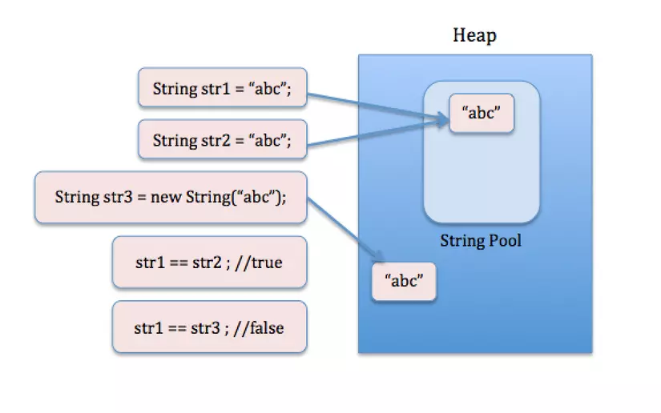
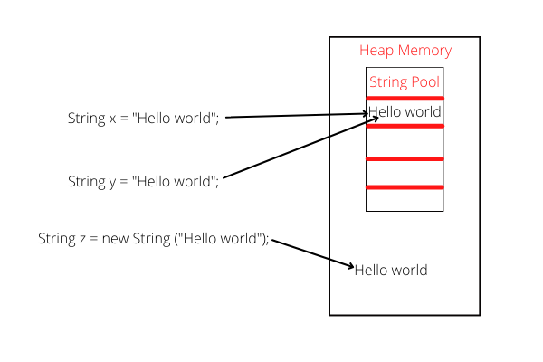

# Tính bất biến
Trong java đối tượng string là bất biến(immutable). Bất biến có nghĩa là không thể thay đổi.
Chuỗi là bất biến vì: -

1. Thiết kế: - Chuỗi nhóm chỉ có thể vì Chuỗi là bất biến trong java, theo cách này, Java Runtime tiết kiệm rất nhiều không gian heap java vì các biến Chuỗi khác nhau có thể tham chiếu đến cùng một biến Chuỗi trong nhóm. Nếu Chuỗi sẽ không bất biến, thì việc thực hiện Chuỗi sẽ không thể thực hiện được vì nếu có bất kỳ biến nào thay đổi giá trị, thì nó cũng sẽ được phản ánh sang các biến khác.

2. Bảo mật: - Nếu String không bất biến thì nó sẽ gây ra mối đe dọa bảo mật nghiêm trọng cho ứng dụng. Ví dụ: tên người dùng cơ sở dữ liệu, mật khẩu được truyền dưới dạng Chuỗi để nhận kết nối cơ sở dữ liệu và trong máy chủ lập trình ổ cắm và chi tiết cổng được truyền dưới dạng Chuỗi. Vì String là bất biến nên giá trị của nó không thể thay đổi nếu không bất kỳ hacker nào cũng có thể thay đổi giá trị được tham chiếu để gây ra sự cố bảo mật trong ứng dụng.

3. An toàn chủ đề: - Vì Chuỗi là bất biến, nên an toàn cho đa luồng và một thể hiện Chuỗi đơn có thể được chia sẻ qua các luồng khác nhau. Điều này tránh việc sử dụng đồng bộ hóa cho an toàn luồng, Chuỗi hoàn toàn an toàn cho luồng

4. Trình nạp lớp: - Chuỗi được sử dụng trong trình nạp lớp java và tính không thay đổi cung cấp bảo mật rằng lớp đúng được tải bởi Trình tải lớp. Ví dụ, hãy nghĩ về một trường hợp mà bạn đang cố tải lớp java.sql.Connection nhưng giá trị được tham chiếu được thay đổi thành lớp myhacked.Connection có thể thực hiện những điều không mong muốn vào cơ sở dữ liệu của bạn.

5. Bộ nhớ đệm: - Vì Chuỗi là bất biến, nên mã băm của nó được lưu vào bộ đệm tại thời điểm tạo và không cần phải tính lại. Điều này làm cho nó trở thành một ứng cử viên tuyệt vời cho khóa trong Bản đồ và nó xử lý nhanh hơn các đối tượng khóa HashMap khác. Đây là lý do tại sao String chủ yếu được sử dụng Object làm khóa HashMap. Trên đây là một số lý do tôi có thể nghĩ về điều đó cho thấy lợi ích của tính bất biến String. Đây là một tính năng tuyệt vời của lớp Chuỗi Java và làm cho nó trở nên đặc biệt.
# String pool
- String pool là một vùng nhớ đặc biệt nằm trong vùng nhớ Heap (Heap memory), dùng để lưu trữ các biến được khai báo theo kiểu String.
- String pool giúp tối ưu hoá việc lưu trữ và sử dụng vùng nhớ khi khai báo biến String, giúp hạn chế tình trạng tràn bộ nhớ Java Heap Space.

